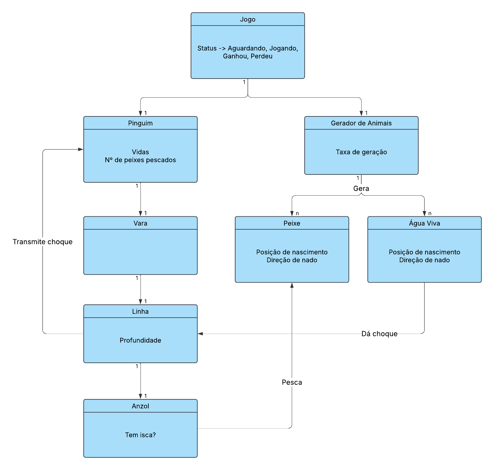

# Análise orientada a objeto
> [!NOTE]
> A **análise** orientada a objeto consiste na descrição do problema a ser tratado, duas primeiras etapas da tabela abaixo, a definição de casos de uso e a definição do domínio do problema.

## Descrição Geral do domínio do problema

### Domínio do problema

Os objetos do domínio do problema são:

- Jogo
- Gerador de animais
- Peixe
- Água Viva
- Pinguim
- Linha de pesca

O jogo é composto por um pinguim que está pescando no gelo, por meio de um buraco. Seu objetivo é pescar 20 peixes para ganhar, enquanto se mantém vivo ao evitar os choques com a água viva. O jogador é o pinguim e pode mover a linha de pesca para cima e para baixo utilizando o mouse. Ao encostar a ponta da linha em um peixe, o peixe é pescado e o jogador ganha um ponto. Se o pinguim encostar na água viva, ele perde uma vida. O jogo termina quando o pinguim perde todas as suas vidas. Os peixes e águas vivas são gerados aleatoriamente e controlados pelo gerador de animais, que também controla a taxa de geração dos animais, aumentando progressivamente a dificuldade até um limite. 

### Requisitos Funcionais

- O jogo deve ser capaz de gerar peixes e águas vivas aleatoriamente.
- O jogo deve ser capaz de controlar a taxa de geração dos animais, aumentando progressivamente a dificuldade até um limite.
- O jogo deve ser capaz de verificar se o pinguim encostou na água viva.
- O jogo deve ser capaz de verificar se o pinguim encostou em um peixe.
- O jogo deve ser capaz de verificar se o pinguim perdeu todas as suas vidas.

### Requisitos Não-Funcionais

- O jogo será desenvolvido em C++, utilizando Qt para a interface gráfica, sendo criado com o Qt Creator.

## Diagrama de Casos de Uso

- Para iniciar o jogo, o usuário deve clicar no botão "Jogar" no menu principal. 
- O jogo vai iniciar com um pinguim com 3 vidas na posição inicial e após 1 segundo, o gerador de animais deve ser iniciado, com uma taxa de geração de 2 segundos por peixe e 4 segundos por água viva.
- O jogador deve mover o mouse para cima e para baixo e a linha de pesca deve seguir o movimento vertical do mouse.
- Quando a ponta da linha de pesca encostar em um peixe, o peixe deve ser pescado e o jogador ganha um ponto.
- Quando uma água viva encostar em qualquer parte da linha, o pinguim leva um choque e perde uma vida.
- Se o jogador atingir 20 peixes, o jogo termina e o jogador ganha a partida.
- Se o jogador perder todas as suas vidas, o jogo termina e o jogador perde a partida, podendo reiniciar o jogo clicando no botão "Reiniciar" no menu principal.
- A cada 5 peixes pescados, a taxa de geração dos animais deve ser diminuída em 0.5 segundos, até um limite de 0.5 segundos por peixe e 1 segundo por água viva.

Apresentar o diagram de casos de uso, identificando as funcionalidades do sistema assim como os atores envolvidos
 
## Diagrama de Domínio do problema

## Análise de caso de uso

### Caso de uso 1: Iniciar o jogo

A análise do caso de uso 1 pode ser acessada [aqui](usecase.md).

[Retroceder](README.md) | [Avançar](projeto.md)

