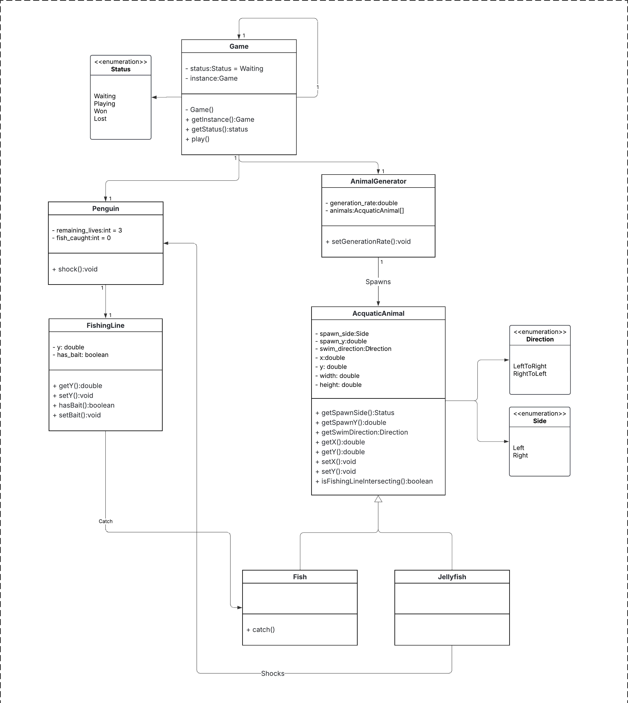

# Projeto orientado a objeto

>[!NOTE]
>O **Projeto orientado a objeto** é composto pelas documentação do projeto descrito em UML. Deve incluir um Diagrama de Classes do sistema projetado, e pelo menos um diagrama de interação de um dos casos de uso. Outros diagramas podem ser apresentados, caso julgue necessário.

 

[Retroceder](analise.md) | [Avançar](implementacao.md)

