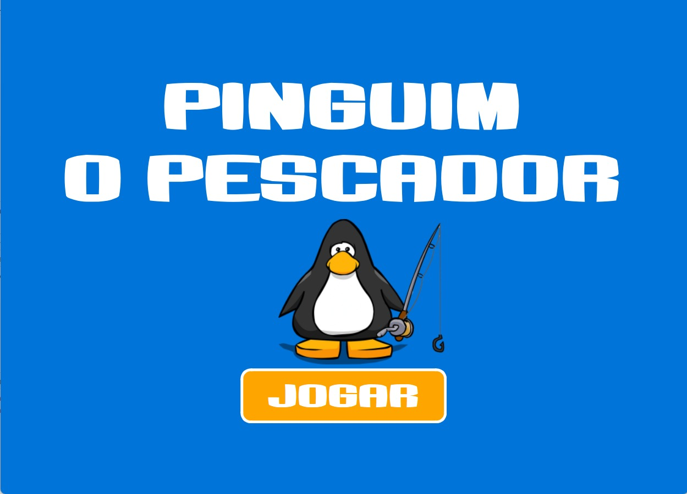
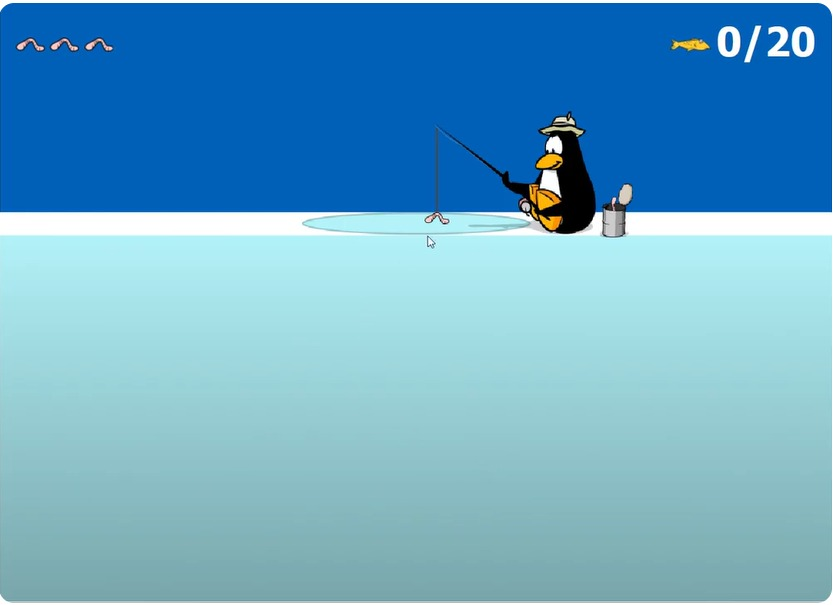
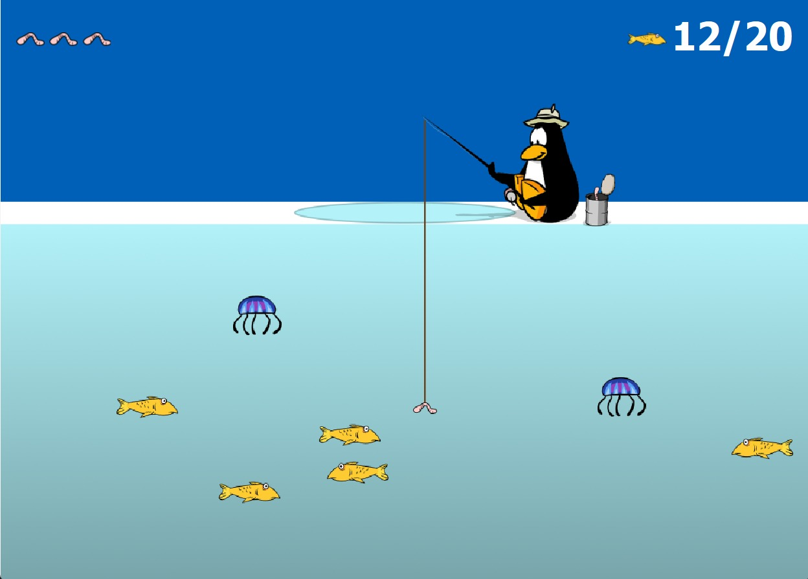
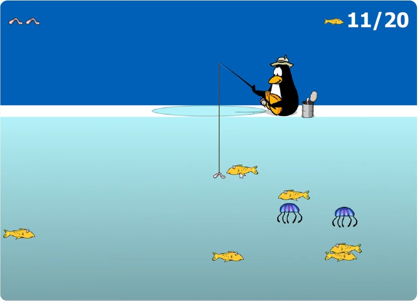
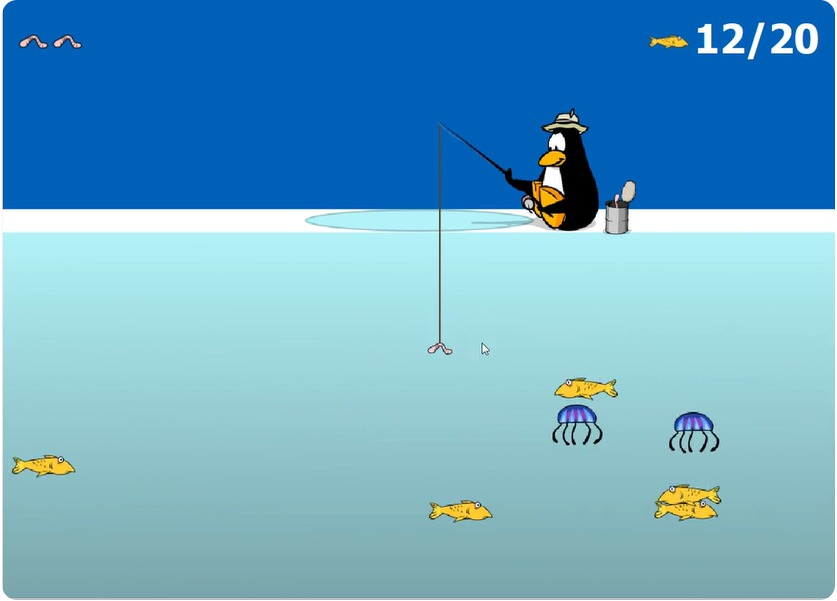
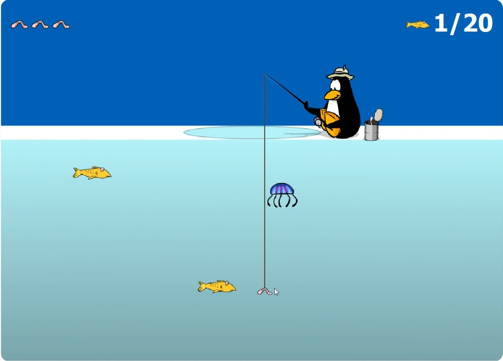
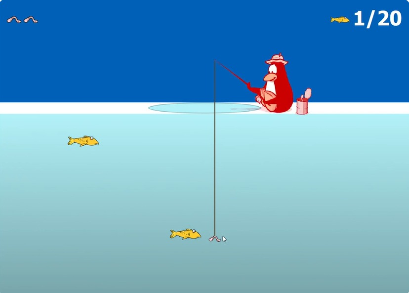
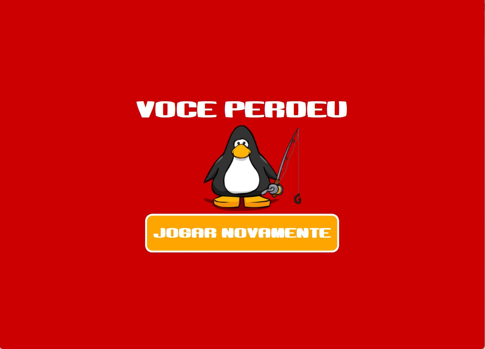
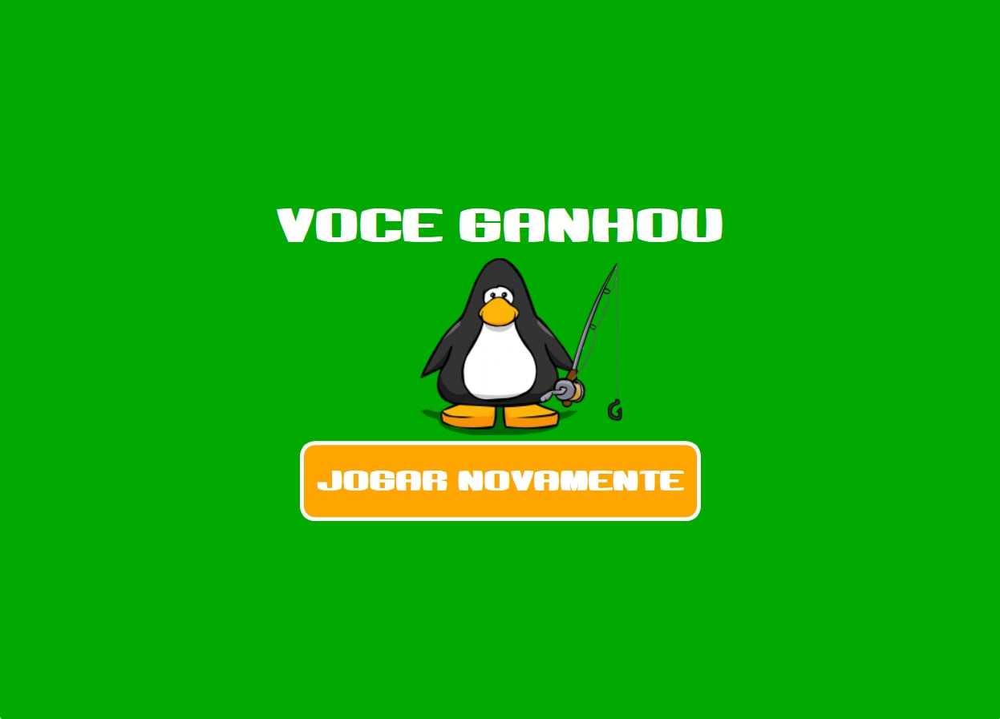

# Testes

>[!NOTE]
> Relatar o processo de testes do sistema, especificando quais testes foram realizados e os resultados obtidos.

Ao inicializar o jogo, a tela inicial é exibida, com o título "Pinguim O Pescador", o botão "JOGAR" e o pinguim.

Ao clicar em "JOGAR", o jogo inicia e o pinguim é exibido na interface do jogo, com a quantidade de vidas em 3 e a quantidade de peixes pescados em 0/20.

Ao mesmo tempo, o gerador de animais é iniciado e começa a gerar peixes e águas vivas aleatoriamente.

Ao clicar na isca segurando o mouse, a linha de pesca se move acompanhando verticalmente o mouse.

Ao encostar a ponta da linha de pesca em um peixe, o peixe é pescado, sumindo da tela e aumentando a quantidade de peixes em 1 unidade.

Quando uma água viva encosta em qualquer parte da linha de pesca, o pinguim é atingido, perdendo uma vida e mostrando um efeito de choque vermelho.

Quando o pinguim perde todas as suas vidas, o jogo termina e a tela de derrota é exibida, com a mensagem "VOCE PERDEU", o botão "JOGAR NOVAMENTE" e o pinguim.

Quando o pinguim atinge 20 peixes, o jogo termina e a tela de vitória é exibida, com a mensagem "VOCE GANHOU", o botão "JOGAR NOVAMENTE" e o pinguim.

Quando o jogador clica em "JOGAR NOVAMENTE", o jogo é reiniciado, sendo o estado de vidas resetado para 3 e peixes pescados para 0. O usuário é levado para a tela inicial, onde pode continuar jogando ao clicar em "JOGAR".

[Retroceder](implementacao.md) | [Início](README.md)

